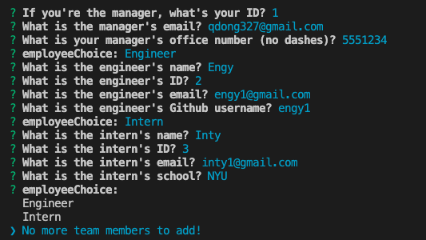
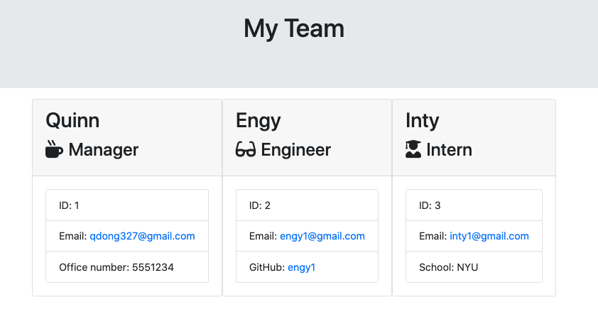

# HTML Template Engine

### Description: 
A Node.js CLI application to generate an HTML page for a project team. It is created using Javascript ES5 and ES6, the Inquirer package, Jest for unit testing and Node.js.

# Table of Contents 
- [Installation](https://github.com/qudoki/templateengine/blob/master/README.md#installation)
- [Usage](https://github.com/qudoki/templateengine/blob/master/README.md#usage)
- [Tests](https://github.com/qudoki/templateengine/blob/master/README.md#testing)
- [Contributing](https://github.com/qudoki/templateengine/blob/master/README.md#contributions)
- [Questions](https://github.com/qudoki/templateengine/blob/master/README.md#questions)
- [License](https://github.com/qudoki/templateengine/blob/master/README.md#license)

## Installation: 
- This package requires node.js, Jest and Inquirer. You can install the package dependencies by entering the following command: "npm init" or "npm i"
- This will install all package dependencies.

## Usage: 
- In order to run this package, please enter the following command: "node app.js" and follow the prompts.
#### Screenshot

## Testing: 
- In order to test this package, please enter the following command: "npm run test" and check for completion.
- This package has passed all tests, see video for testing runthrough.

## Contributions: 
- In most cases, please refer to this document: [Contributor Covenant](https://www.contributor-covenant.org/) 
- Please contact the author if you would like to make a contribution.
- Requests can be made by using the contact information below.

## Questions: 
If you have any questions, please feel free to reach me via Github or email below.
[Github Profile](https://github.com/qudoki)
[Email Address]<qdong327@gmail.com>

## License: MIT 

    Copyright 2020 Quinn Dong Kilkenny 

    Permission is hereby granted, free of charge, to any person obtaining a copy of this software and associated documentation files (the "Software"), to deal in the Software without restriction, including without limitation the rights to use, copy, modify, merge, publish, distribute, sublicense, and/or sell copies of the Software, and to permit persons to whom the Software is furnished to do so, subject to the following conditions:
    The above copyright notice and this permission notice shall be included in all copies or substantial portions of the Software.
    THE SOFTWARE IS PROVIDED "AS IS", WITHOUT WARRANTY OF ANY KIND, EXPRESS OR IMPLIED, INCLUDING BUT NOT LIMITED TO THE WARRANTIES OF MERCHANTABILITY, FITNESS FOR A PARTICULAR PURPOSE AND NONINFRINGEMENT. IN NO EVENT SHALL THE AUTHORS OR COPYRIGHT HOLDERS BE LIABLE FOR ANY CLAIM, DAMAGES OR OTHER LIABILITY, WHETHER IN AN ACTION OF CONTRACT, TORT OR OTHERWISE, ARISING FROM, OUT OF OR IN CONNECTION WITH THE SOFTWARE OR THE USE OR OTHER DEALINGS IN THE SOFTWARE.
